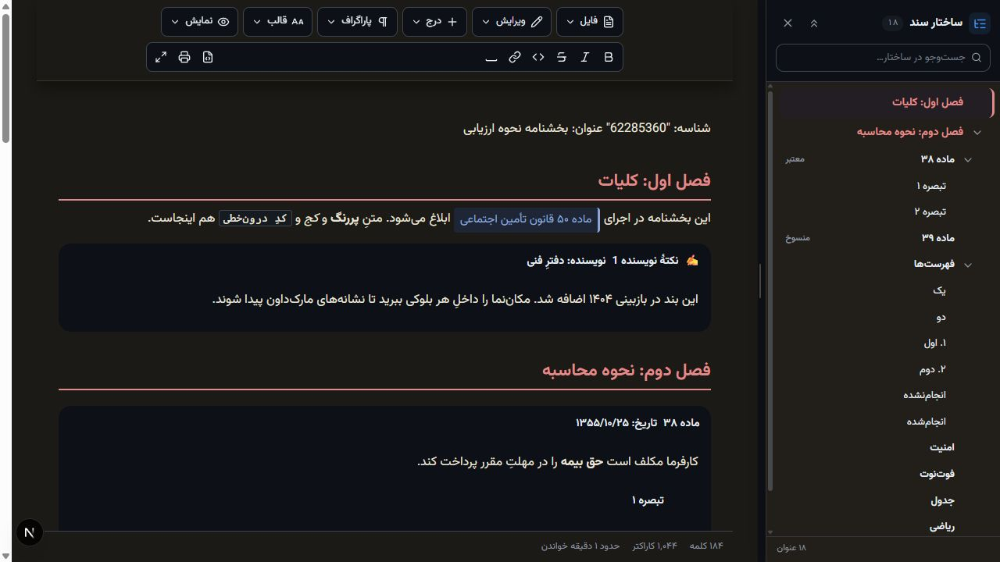
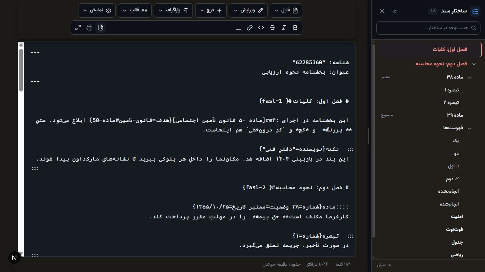

# NilaMarkdown Editor

<div align="center">
  <strong>A modern bilingual Markdown editor built for Persian and English documents.</strong>
  <br />
  <strong>ویرایشگر مدرن مارک‌داون برای اسناد فارسی و انگلیسی</strong>
</div>

<br />



## English

NilaMarkdown Editor is a React-based Markdown editor and viewer designed for long, structured RTL and LTR documents. It combines a rich editing surface, a synchronized source mode, and a searchable document outline so users can move through large documents quickly and precisely.

### Highlights

- Rich Markdown editing with immediate visual feedback
- Raw source mode with synchronized outline navigation
- Accurate heading navigation in both rendered and source views
- Collapsible, searchable document outline for long documents
- First-class Persian/RTL and English/LTR support
- Tables, task lists, blockquotes, footnotes, math, code blocks, and Mermaid diagrams
- Custom directives for structured legal and administrative content
- Safe handling of links and embedded HTML
- Reusable React package plus a Next.js demonstration app
- Automated unit, type-checking, and Playwright end-to-end tests

### Source mode



### Quick start

Requirements: Node.js 20+ and pnpm 11.

```bash
git clone https://github.com/mnikoie/NilaMarkdown-Editor.git
cd NilaMarkdown-Editor
pnpm install
pnpm dev
```

Open [http://localhost:3000/markdown](http://localhost:3000/markdown).

On Windows, double-click `NilaMarkdown.bat` to build and run the production version. It opens the editor automatically in your browser. For later launches without rebuilding, run `NilaMarkdown.bat --no-build`.

### Useful commands

```bash
pnpm dev          # Start the Next.js demo
pnpm build        # Build the editor package and demo app
pnpm typecheck    # Run TypeScript checks
pnpm test         # Run unit tests
pnpm test:e2e     # Run Playwright tests
```

### Repository structure

| Path | Purpose |
| --- | --- |
| `packages/markdown` | Reusable editor/viewer package |
| `apps/web` | Next.js demonstration app |
| `tests/e2e` | Browser end-to-end tests |
| `docs` | Architecture notes and project images |

### Technology

React 19, TypeScript, ProseMirror, unified/remark, Tailwind CSS, Next.js 16, Vitest, and Playwright.

---

## فارسی

NilaMarkdown Editor یک ویرایشگر و نمایشگر مارک‌داون مبتنی بر React است که برای اسناد طولانی و ساختاریافتهٔ فارسی و انگلیسی طراحی شده است. این پروژه ویرایش دیداری، حالت نمایش سورس و ساختار درختی سند را در یک محیط یکپارچه ارائه می‌کند تا حرکت میان فصل‌ها و عنوان‌ها دقیق و سریع باشد.

### قابلیت‌ها

- ویرایش مارک‌داون همراه با نمایش فوری نتیجه
- حالت سورس با ناوبری هماهنگ‌شده با ساختار سند
- هدایت دقیق به ابتدای عنوان در نمای دیداری و حالت سورس
- ساختار درختی تاشو و قابل جست‌وجو برای اسناد طولانی
- پشتیبانی کامل از فارسی و راست‌به‌چپ، در کنار انگلیسی و چپ‌به‌راست
- پشتیبانی از جدول، فهرست وظایف، نقل‌قول، پانویس، فرمول ریاضی، بلوک کد و نمودار Mermaid
- دایرکتیوهای سفارشی برای محتوای حقوقی و اداری ساختاریافته
- مدیریت امن لینک‌ها و HTML جاسازی‌شده
- پکیج React قابل استفادهٔ مجدد به‌همراه برنامهٔ نمایشی Next.js
- تست‌های واحد، بررسی TypeScript و تست‌های سرتاسری Playwright

### اجرای پروژه

پیش‌نیازها: Node.js نسخهٔ ۲۰ یا بالاتر و pnpm نسخهٔ ۱۱.

```bash
git clone https://github.com/mnikoie/NilaMarkdown-Editor.git
cd NilaMarkdown-Editor
pnpm install
pnpm dev
```

سپس نشانی [http://localhost:3000/markdown](http://localhost:3000/markdown) را باز کنید.

در ویندوز کافی است روی فایل `NilaMarkdown.bat` دوبار کلیک کنید تا نسخهٔ نهایی ساخته و اجرا شود؛ صفحهٔ ویرایشگر نیز خودکار در مرورگر باز می‌شود. برای اجراهای بعدی بدون ساخت مجدد، دستور `NilaMarkdown.bat --no-build` را اجرا کنید.

### دستورهای کاربردی

```bash
pnpm dev          # اجرای برنامهٔ نمایشی Next.js
pnpm build        # ساخت پکیج ویرایشگر و برنامهٔ نمایشی
pnpm typecheck    # بررسی TypeScript
pnpm test         # اجرای تست‌های واحد
pnpm test:e2e     # اجرای تست‌های سرتاسری Playwright
```

### ساختار مخزن

| مسیر | کاربرد |
| --- | --- |
| `packages/markdown` | پکیج قابل استفادهٔ مجدد ویرایشگر و نمایشگر |
| `apps/web` | برنامهٔ نمایشی Next.js |
| `tests/e2e` | تست‌های سرتاسری مرورگر |
| `docs` | مستندات معماری و تصاویر پروژه |

---

Created and maintained by [M. Nikoie](https://github.com/mnikoie).
